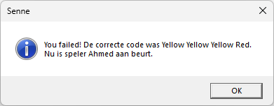
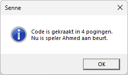
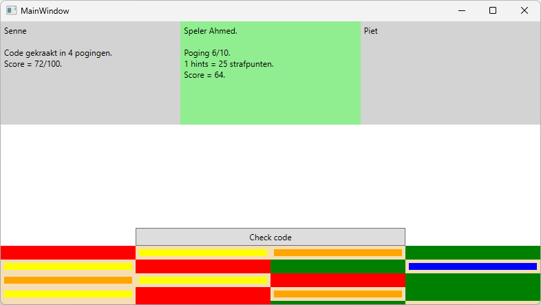

# Finale versie Mastermind

In deze sprint gaan we de finale versie opleveren van ons spel. Hiervoor moeten er nog wat uitbreidingen geprogrammeerd worden.

**Spelverloop:**

- Momenteel kan het spel maar door 1 speler gespeeld worden. We gaan dit uitbreiden door de mogelijkheid te voorzien om meerdere spelernamen toe te voegen.
- Wanneer een speler zijn/haar spel beëindigd heeft wordt een berichtvenster getoond. Hierin gaan we nu ook de naam van de volgende speler tonen.
- Om nog duidelijker te maken wie aan het spelen is gaan we naast de score ook de naam van de huidige speler tonen.
- Om de speler de mogelijkheid te geven om te code te kunnen raden binnen het maximaal aantal pogingen gaan we de mogelijkheid geven om hints te kopen.
- In de historiek opbouw gaan we een tooltip tonen die meer info toont over de kleur waarover gehovered wordt.

Gebruik de namen die voorzien zijn in de functionele vereisten, maar **zorg ervoor dat je de naming conventions hierop toepast**!

### Functionele vereisten

| ID | Onderwerp | Beschrijving |
| :--- | :--- | :--- |
| Mastermind-12 | Extra spelers | In de methode *startgame* wordt nu de naam van de speler gevraagd. Wijzig dit zodat er namen van meerdere spelers ingegeven kunnen worden. Na het vragen van de naam van de eerste speler stel je de vraag of men nog een speler wil toevoegen. Dit blijf je doen tot men hierop *Nee* antwoordt. De spelernamen voeg je toe aan een generic list. |
| Mastermind-13 | Speleinde | Na een speleinde is de volgende speler aan de beurt. In de bestaande melding die je nu toont (zie Mastermind-09 en Mastermind-PE2-03) ga je in de titel de naam van de huidige speler tonen en de beschrijving uitbreiden met de naam van de volgende speler.   |
| Mastermind-14 | Huidige speler | Omdat ons spel nu met meerdere spelers kan gespeeld worden, moet duidelijk getoond worden wie de actieve speler is. Momenteel toon je het aantal pogingen en de score in een label (Mastermind-08). Breid dit uit met de naam van de huidige speler. |
| Mastermind-15 | Hint | We gaan de mogelijkheid geven om een hint te kopen. De speler heeft de keuze tussen een juiste kleur en een juiste kleur op de juiste plaats. Het spreekt voor zich dat dit niet gratis is. Een juiste kleur kost 15 strafpunten en een juiste kleur op de juiste plaats kost 25 strafpunten. Maak hiervoor gebruik van een berichtventer. |
| Mastermind-16 | Tooltip | Wanneer een speler een gok heeft gewaagd wordt hiervan feedback gegeven in de vorm van een witte of rode rand (zie Mastermind-05). Om het voor de speler duidelijker te maken gaan we een tooltip voorzien. Voorzie onderstaande teksten: witte rand: "Juiste kleur, foute positie" rode rand: "Juiste kleur, juiste positie" geen kleur: "Foute kleur" |
| Extra-01 | Meer kleuren | Momenteel is het voorzien om met 4 kleuren te spelen. Breid je spel uit zodat de speler de keuze heeft tussen 4, 5 of 6 kleuren. |
| Extra-02 | Actieve speler | Breid Mastermind-14 uit zodat je voor elke speler een label voorziet. Alle labels zijn constant zichtbaar, dus ook van de spelers die hun spel al beëindigd hebben. Voor de actieve speler voorzie je een andere achtergrondkleur.  |

## Aanpak en tips

### Stappenplan

-   Analyseer grondig wat er geprogrammeerd moet worden en hoe je dat gaat doen.
-   Probeer te achterhalen wat het moeilijkste deel van de oefening is.
-   Programmeer het spel in Visual Studio.
-   Test het spel om te zien of het in alle omstandigheden werkt.
-   Zorg ervoor dat je code mooi gestructureerd is (vb. gebruik zinvolle namen voor variabelen).

### Programmeertips

-   Maak gebruik van methods om je code overzichtelijk en beheersbaar te houden!
